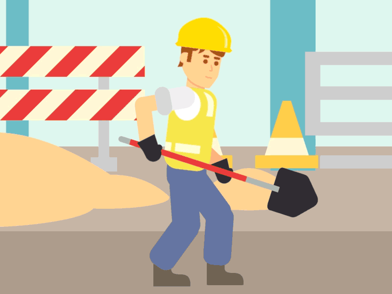
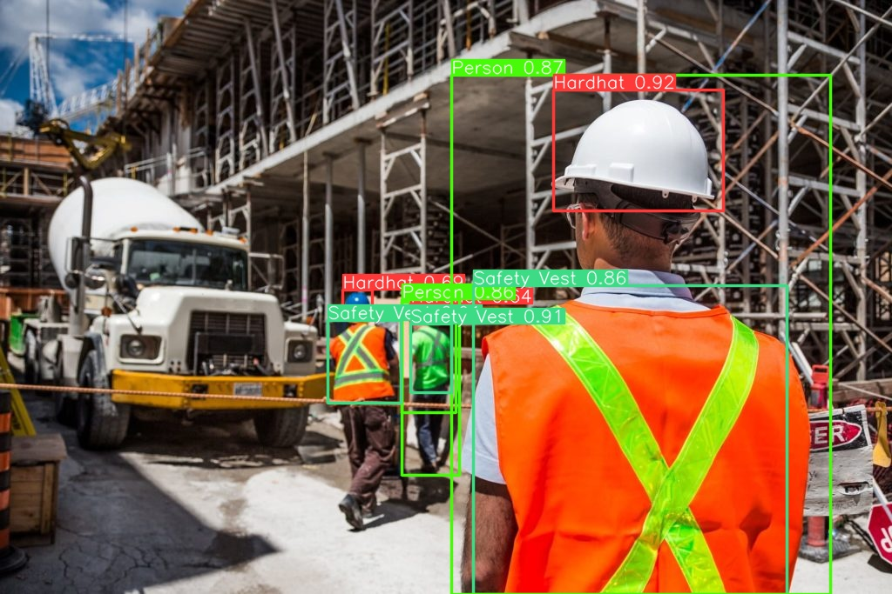
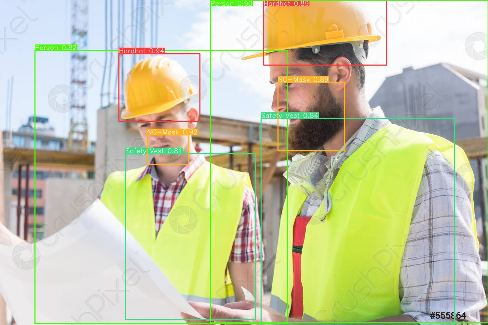
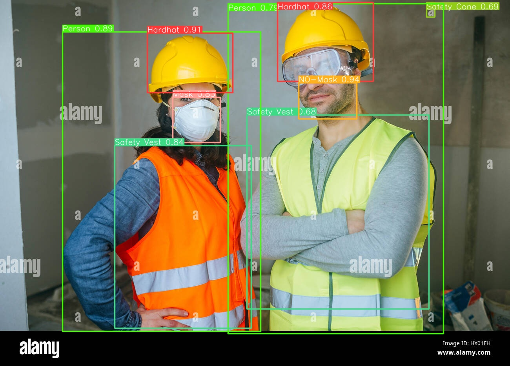

<div align="center">

# 🦺 Worker Safety — PPE Detection

### AI that watches for missing hard hats and safety vests, so people don't have to.



[](tests/)
[](pyproject.toml)
[](ATTRIBUTION.md)
[](https://docs.ultralytics.com)

**[▶️ Try the demo](#-try-it-yourself)** · **[📸 See it in action](#-see-it-in-action)** · **[🧠 Technical deep-dive](docs/TECHNICAL.md)**

</div>

---

## 🤔 What is this?

> 4,764 workers died on the job in 2020. Nearly half of all fatal workplace injuries came from construction, transportation, and material-handling work.
> — *U.S. Occupational Safety and Health Administration*

A huge share of those accidents come down to something painfully simple: **someone wasn't wearing their safety gear.** A missing hard hat. A missing vest. A moment nobody was watching.

This project teaches a computer to watch instead — pointing a camera at a job site and automatically spotting **who is, and who isn't,** wearing the protective equipment they need.

It doesn't replace a safety officer. It gives one an extra set of eyes that never blinks, never gets tired, and never misses a shift.

---

## 🎯 What it actually does

Point a photo, video, or webcam at a group of people, and it will:

1. **Find every person** in the frame.
2. **Find every piece of safety gear** — hard hats, vests, goggles, gloves, masks.
3. **Match gear to the right person** (not just "there's a helmet somewhere in this photo").
4. **Say, in plain English, who's missing what:**

   > 🟢 *Worker 0 — compliant*
   > 🔴 *Worker 1 — missing helmet and vest*
   > 🔴 *Worker 3 — missing helmet*

That's it. Simple question, simple answer, per person, every frame.

---

## 📸 See it in action

<table>
<tr>
<td width="33%">

**Before**
Raw camera frame — just people on a site.

</td>
<td width="33%">

**AI looks**
Every person and every piece of gear gets boxed and labeled.

</td>
<td width="33%">

**Verdict**
Each worker gets a compliant/violation call you can act on.

</td>
</tr>
</table>

<div align="center">


</div>

<div align="center">


</div>

*(These sample results come from the inherited baseline model — see [credits](#-credits--honesty) below.)*

---

## 🧠 How it thinks (without the jargon)

| Step | In plain words |
|---|---|
| **1. Look** | A YOLOv8 object-detection model scans the image and draws a box around every person and every piece of gear it recognizes. |
| **2. Match** | For each person, the system checks: is a hard hat box sitting on top of them? A vest box? It links gear to the person wearing it, not just "somewhere in the photo." |
| **3. Judge** | Every worker needs a **helmet** and a **vest** at minimum. Anything missing (or an explicit "no helmet" / "no vest" detection) gets flagged as a violation. Goggles, gloves, and masks are tracked too, just not required by default. |
| **4. Report** | The result is a short, human-readable line per worker — no dashboards to decode, no numbers to interpret. |

Fourteen kinds of gear are recognized in total: helmet, vest, goggles, gloves, mask (plus their "missing" counterparts), person, safety cone, ladder, and fall-detected.

---

## 🚀 Try it yourself

You don't need to know Python to see this run — just follow along.

### Option 1 — The 2-minute cloud version (no install)

1. Open [`tests/test_e2e_colab.ipynb`](tests/test_e2e_colab.ipynb) in **[Google Colab](https://colab.research.google.com/)** (free, runs in your browser).
2. Turn on a free GPU: `Runtime → Change runtime type → T4 GPU`.
3. Click `Runtime → Run all`.

You'll watch it clone the project, load the model, and detect PPE on real photos — right there in the notebook, no setup on your own machine.

### Option 2 — Run the local web app

For a proper point-and-click experience with your own photos/videos/webcam:

```bash
# 1. Get the code and install what it needs
git clone https://github.com/A-Kuo/Worker-Safety-PPE-Detection-Model.git
cd Worker-Safety-PPE-Detection-Model
python -m pip install -r requirements.txt
python -m pip install -r app/requirements.txt

# 2. Start the two pieces (one API, one UI)
uvicorn app.api.main:app --reload &
streamlit run app/ui/streamlit_app.py
```

A browser tab opens automatically with the **Streamlit** interface: upload a photo, a video, or use your webcam, and watch the compliance labels appear on screen. Full walk-through: [`app/README.md`](app/README.md).

---

## 🧰 What's inside this repository

```text
src/ppe/       →  The "brain": detection, PPE-to-person matching, and the compliance rules
app/           →  The point-and-click demo (web page + API) that uses the brain above
scripts/       →  Command-line tools for downloading data, training, and evaluating
configs/       →  Settings files for datasets and training experiments
baselines/     →  A borrowed, pre-trained model used as a starting reference point
docs/          →  Deep technical notes: datasets, math, experiment results
tests/         →  Automated checks that everything still works (see below)
```

---

## ✅ Is it actually tested?

Yes — every core piece of logic is automatically checked on every change, so a broken build never sneaks through quietly.

| | |
|---|---|
| **39 automated tests** | run on every update, covering label mapping, PPE-to-person matching, and the detection pipeline |
| **Runs on 3 Python versions** | 3.10, 3.11, and 3.12, via GitHub Actions |
| **GPU tests in the cloud** | the full model + real photos are exercised in the [Colab notebook](tests/test_e2e_colab.ipynb), since GitHub's free runners don't have a GPU |

Want to run the checks yourself?

```bash
pip install pytest pyyaml
PYTHONPATH=src python -m pytest tests/ -v
```

More detail (what's tested, why, and how to add more) lives in [`docs/TECHNICAL.md`](docs/TECHNICAL.md#testing).

---

## 🔭 What's next

- **Tracking** — give each worker a stable ID across frames, instead of re-detecting them fresh every frame.
- **Alerts** — hook violations into a dashboard, alarm, or notification system for live sites.
- **Night vision** — extend detection to thermal/infrared cameras for low-light shifts.
- **Bigger, better models** — larger YOLOv8 variants and quantized exports for faster edge deployment.

---

## 🙏 Credits & honesty

This project is built as an honest, from-scratch engineering exercise on top of a **borrowed starting point** — not a claim that everything here was trained from zero.

| What's borrowed | What's original to this repo |
|---|---|
| The baseline YOLOv8n model weights, training plots, and sample results, from [Snehil Sanyal's Construction-Site-Safety-PPE-Detection](https://github.com/snehilsanyal/Construction-Site-Safety-PPE-Detection) (the inspiration for this project) | The unified 14-class label schema across three different datasets |
| The original Roboflow dataset notes | The person↔PPE matching and compliance-verdict logic |
| | The full training/evaluation/calibration pipeline (scripts + configs) |
| | The FastAPI + Streamlit demo app |
| | The automated test suite and CI setup |

Datasets used are from Roboflow Universe under **CC BY 4.0** — see [`ATTRIBUTION.md`](ATTRIBUTION.md) for the full license and citation details.

---

<div align="center">

**Want the full technical picture** — dataset breakdowns, the training experiment grid, calibration math, and evaluation protocol? **→ [Read the technical deep-dive](docs/TECHNICAL.md)**

</div>
